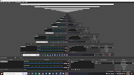
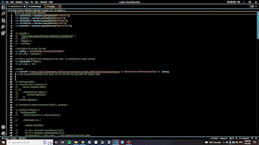
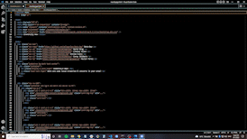
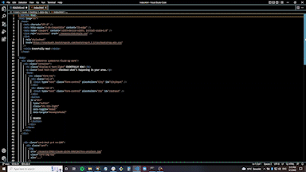

# data-day

## An Evening at a Glance
***
AS A USER I want to find something to do with friends
WHEN I enter my zip code or city
THEN I AM SHOWN choices of music events at local venues with nearby local breweries to attend
***
### Description
***
Eventfully Now is a simple application to inquire about local music events and find a local brewery to visit before your show. Just enter your location!
***
### Installation Process
***

***
### Usage 
***

When a patron accesses our webpage by URL they will be brought to the landing page where they can search a location. When the location has been input then the patron will have the option of choosing between local events and a brewery located near their chosen event venue. When the patron has chosen their preferred brewery and event then they will have successfully used our application.  
***

### Credits
***
[AK](https://github.com/aKingsView)

[RJ](https://github.com/Are-Jae)

[Corey](https://github.com/skidmoreco)

[Hector](https://github.com/noviceprogrammeroh)

[Lindsay](https://github.com/katsaymeow)

#### Sources

[TicketMaster API](https://developer.ticketmaster.com/products-and-docs/apis/getting-started/#rate-limit)

[OpenBrewery DB](https://www.openbrewerydb.org/documentation#list-breweries)

[GitHub Docs](https://github.com/git-guides/git-pull)

[presentation](https://docs.google.com/presentation/d/1AKUStJSvZ79909nq-D1W3VIIjpzJEUTxdQpDhGA6q5s/edit#slide=id.g14990a2cdf2_0_5)

